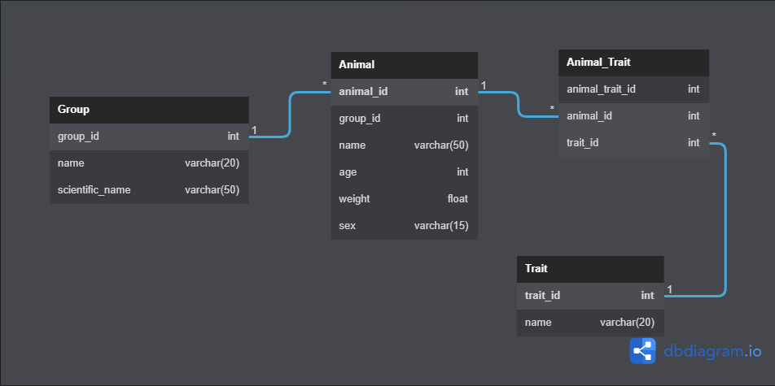

# Kenzie Pet

Este projeto é uma API Django RESTful para gerenciar animais, grupos e traços de cada animal.

## Funcionalidades Principais

- Diagrama de Entidade e Relacionamento.
- App de animals:
  - Model.
  - Serializers para dados de entrada e saída.
  - Sobrescrita dos métodos create e update do serializer.
  - Views de criação, listagem, filtragem, atualização e deleção de animal.
  - Tratamento de exceção nas rotas de criação, atualização, filtragem e deleção.
  - Campo de leitura utilizando SerializerMethodField.
- App de groups:
  - Model.
  - Serializers para dados de entrada e saída.
- App de traits:
  - Model.
  - Serializers para dados de entrada e saída.
- Testes de Models:
  - Atributos.
  - Relacionamentos.

## Instalação e Configuração

1. Clone o repositório: `git clone https://github.com/talitta-nunes/kenzie-pet.git`
2. Navegue até o diretório do projeto: `cd kenzie-pet`
3. Crie um ambiente virtual: `python -m venv venv`
4. Ative o ambiente virtual: 
   - No Windows: `venv\Scripts\activate`
   - No macOS e Linux: `source venv/bin/activate`
5. Instale as dependências: `pip install -r requirements.txt`
6. Execute as migrações: `python manage.py migrate`
7. Inicie o servidor: `python manage.py runserver`

### Endpoints da aplicação:
| Método | Endpoint | Objetivo | 
|---|---|---|
| `POST` | `animals/` |Cadastro de animais | 
| `GET` | `animals/` |Listar animais | 
| `PATCH` | `animals/<int:animal_id>/` |Atualizar dados do animal |

## Diagrama

